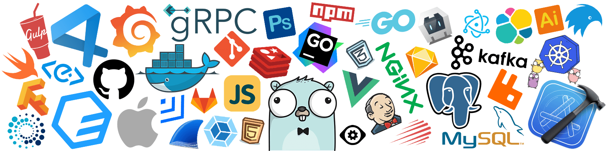

## Hi there   I'm Srijan Das - aka [ghozt777][website]

### I'm currently listening to 🎧

### I'm a Procrastinator, Student 🤓  , CS enthusiast 🖥️  , and a gaming addict 🎮 !!

- 🌱 I’m currently learning everything 🤣
- 🤝 I’m looking to collaborate with other developers
- 🥅 2021 Goals: Getting into Open Source Development
- ⚡ Fun fact: I love to sleep 😴 

### Connect with me:

[][website]

[][twitter]

[][linkedin]

[][instagram]

 

### Languages and Tools that I'm currently learning:

 
 
 

  

  
:zap: Recent GitHub Activity

<!--START_SECTION:activity-->
1. 🎉 Merged PR [#2](https://github.com/ghozt777/ghozt777/pull/2) in [ghozt777/ghozt777](https://github.com/ghozt777/ghozt777)
2. 💪 Opened PR [#2](https://github.com/ghozt777/ghozt777/pull/2) in [ghozt777/ghozt777](https://github.com/ghozt777/ghozt777)
3. 🎉 Merged PR [#14](https://github.com/ghozt777/help-let-me-go/pull/14) in [ghozt777/help-let-me-go](https://github.com/ghozt777/help-let-me-go)
4. 💪 Opened PR [#14](https://github.com/ghozt777/help-let-me-go/pull/14) in [ghozt777/help-let-me-go](https://github.com/ghozt777/help-let-me-go)
5. 🎉 Merged PR [#13](https://github.com/ghozt777/help-let-me-go/pull/13) in [ghozt777/help-let-me-go](https://github.com/ghozt777/help-let-me-go)
<!--END_SECTION:activity-->

[website]: https://ghozt.netlify.app/
[twitter]: https://twitter.com/ghozt60510632
[instagram]: https://www.instagram.com/dontsleeponcustard/
[linkedin]: https://www.linkedin.com/in/srijandas7/

